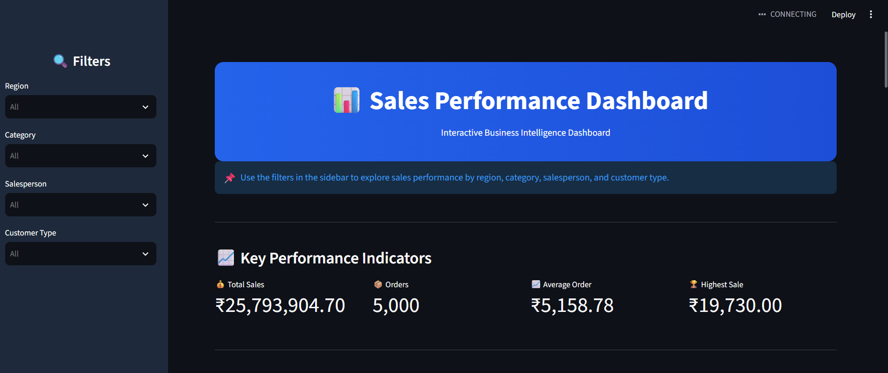

# Sales Performance Analysis Dashboard

An interactive sales analytics and forecasting dashboard built with Python and Streamlit.

## Overview

The Sales Performance Analysis Dashboard helps analyze sales performance, track KPIs, visualize trends, and generate forecasts from sales data.

## Features

- Interactive sales dashboard
- KPI performance tracking
- Sales trend analysis
- Interactive data filters
- Sales visualization
- Sales forecasting
- Analysis and report generation
- Exportable outputs

## Tech Stack

| Category | Technologies |
|---|---|
| Programming | Python |
| Data Analysis | Pandas, NumPy |
| Visualization | Streamlit, Plotly, Matplotlib |
| Machine Learning | Scikit-learn |
| Development | VS Code, Git, GitHub |

## Project Structure

```text
Sales-Performance-Analysis/
│
├── dashboard/
│   ├── app.py
│   ├── charts.py
│   ├── filters.py
│   ├── kpi.py
│   ├── utils.py
│   └── styles.css
│
├── src/
│   ├── analysis.py
│   ├── clean_data.py
│   ├── export_reports.py
│   ├── forecast.py
│   ├── generate_data.py
│   └── visualization.py
│
├── data/
├── charts/
├── output/
├── screenshots/
│
├── main.py
├── requirements.txt
├── .gitignore
└── README.md

Dashboard Preview

## Dashboard Preview

### Main Dashboard



### Monthly Sales Analysis


### Product Analysis


### Regional Performance Analysis


### Sales Records and Filters


### Salesperson Analysis


Windows:

venv\Scripts\activate
5. Install dependencies
pip install -r requirements.txt
6. Run the dashboard
streamlit run dashboard/app.py

The dashboard will open at:

http://localhost:8501
Future Improvements
Advanced forecasting models
Real-time sales data integration
User authentication
Cloud deployment
Automated report generation
Author

Anjali Kumbhar